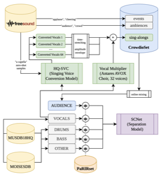

# CrowdioSet and PaRIRset

Official implementation of [CrowdioSet and PaRIRset: Two Datasets Towards Live Music Source Separation](http://arxiv.org/abs/2607.27828) (ISMIR 2026).

🔗 [Project website](https://enricguso.github.io/crowdioset_parirset/) &nbsp;|&nbsp; 📄 [Paper](http://arxiv.org/abs/2607.27828)



---

## Contents

- [Setup](#setup)
- [Preparing the data](#preparing-the-data)
- [Models](#models)
- [Training](#training)
- [Inference](#inference)
- [Evaluation](#evaluation)
- [Citing](#citing)

---

## Setup

```bash
pip install -r requirements.txt
```

## Preparing the data

Data prep merges **MUSDB18HQ**, **MOISESDB**, **CrowdioSet** and **PaRIRset** into a single training set.

1. Download [MOISESDB](https://music.ai/research/) (requires filling a request form).
2. Install the Hugging Face CLI:
   ```bash
   curl -LsSf https://hf.co/cli/install.sh | bash
   ```
3. Download and unzip the remaining datasets:
   ```bash
   curl -L -C - -o musdb18hq.zip "https://zenodo.org/records/3338373/files/musdb18hq.zip?download=1"
   unzip musdb18hq.zip -d musdb18hq
   unzip moisesdb.zip -d moisesdb
   hf download enricguso/crowdioset --repo-type dataset --local-dir crowdioset
   hf download enricguso/parirset --repo-type dataset --local-dir parirset
   ```
4. Install the MOISESDB parser:
   ```bash
   pip install git+https://github.com/moises-ai/moises-db.git
   ```
5. Merge MUSDB18HQ, MOISESDB and the CrowdioSet singalongs into `musdbmoises`:
   ```bash
   python prepare_musdbmoises.py \
     --moises_path moisesdb \
     --musdb_path musdb18hq \
     --out_path musdbmoises \
     --crowdioset_path crowdioset
   ```

## Models

Four checkpoints are provided under [`models/`](models/), each trained on a different data combination and paired with a config in [`conf/`](conf/):

| Model | Directory | Config | Training data |
|---|---|---|---|
| `clean` | `models/M1_clean` | `conf/ismir26_clean.yaml` | MUSDBMOISES |
| `rev` | `models/M2_reverberant` | `conf/ismir26_rev.yaml` | MUSDBMOISES × PaRIRset |
| `noisy` (default, used in the subjective eval) | `models/M3_noisy` | `conf/ismir26_noisy.yaml` | MUSDBMOISES + CrowdioSet |
| `noisyrev` | `models/M4_noisyrev` | `conf/ismir26_noisyrev.yaml` | (MUSDBMOISES + CrowdioSet) × PaRIRset |

## Training

```bash
# noisy (default)
python3 scnet/train_noisy.py --config_path conf/ismir26_noisy.yaml --save_path path/to/save/checkpoint/

# noisyrev
python3 scnet/train_noisy.py --config_path conf/ismir26_noisyrev.yaml --save_path path/to/save/checkpoint/

# clean
python3 scnet/train_clean.py --config_path conf/ismir26_clean.yaml --save_path path/to/save/checkpoint/

# rev
python3 scnet/train_clean.py --config_path conf/ismir26_rev.yaml --save_path path/to/save/checkpoint/
```

## Inference

[`scnet/inference.py`](scnet/inference.py) separates a mixture with a checkpoint selected via the `--noisy` and `--reverberant` flags:

```bash
# noisy (default)
python scnet/inference.py --noisy --mix_path /path/to/mixture.wav --out_path /path/to/output/

# clean
python scnet/inference.py --mix_path /path/to/mixture.wav --out_path /path/to/output/

# rev
python scnet/inference.py --reverberant --mix_path /path/to/mixture.wav --out_path /path/to/output/

# noisyrev
python scnet/inference.py --noisy --reverberant --mix_path /path/to/mixture.wav --out_path /path/to/output/
```

## Evaluation

To reproduce the paper's objective evaluation, use [`scnet/crowdioset_eval.py`](scnet/crowdioset_eval.py) and [`scnet/parirset_eval.py`](scnet/parirset_eval.py) (may need some tweaking for your data layout).

---

## Citing

If you find our work useful in your research, please consider citing:

```bibtex
@inproceedings{guso2026crowdioset,
  title={CrowdioSet and PaRIRset: Two Datasets Towards Live Music Source Separation},
  author={Gus{\'o}, Enric and Serra, Xavier},
  booktitle={Proceedings of the 27th International Society for Music Information Retrieval Conference (ISMIR)},
  year={2026}
}
```

This work builds on SCNet:

```bibtex
@misc{tong2024scnet,
      title={SCNet: Sparse Compression Network for Music Source Separation},
      author={Weinan Tong and Jiaxu Zhu and Jun Chen and Shiyin Kang and Tao Jiang and Yang Li and Zhiyong Wu and Helen Meng},
      year={2024},
      eprint={2401.13276},
      archivePrefix={arXiv},
      primaryClass={eess.AS}
}
```

## License

[MIT](LICENSE)
